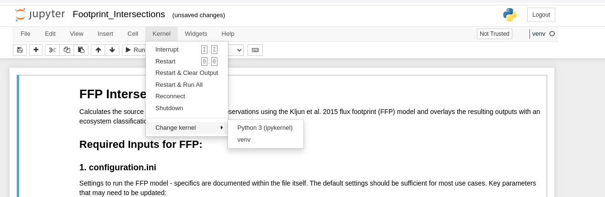

# FFP Overlay

A wrapper for the [Kljun et al. 2015](https://gmd.copernicus.org/articles/8/3695/2015/gmd-8-3695-2015.html) flux footprint (FFP) function to incorporate spatial analysis in the FFP processing pipeline while parallelizing the processing to speed up computation times. 

Kljun, N., Calanca, P., Rotach, M. W., & Schmid, H. P. (2015). A simple two-dimensional parameterisation for Flux Footprint Prediction (FFP). Geoscientific Model Development, 8(11), 3695–3713.

## Example Output

Given half-hourly turbulence conditions and metadata for a site, this wrapper will calculate the FFP on a per-time-step basis, and output FFP contours over desired intervals in this web-map format.  If provided a landscape classification map, the program will also overlay each timestep's footprint with the map.  This allows the user to estimate the relative source contrition of different ecosystem components in some heterogeneous ecosystems.

  <iframe src="Example_Outputs/BB2_FFP.htm." title="Processes" scrolling="no" frameborder="0"
    style="border: 0;
   height: 100%;
   left: 0;
   position: absolute;
   top: 0;
   width: 100%;">
   
Your browser does not support iframes.

 </iframe>

## Setup

For best results, you should use Python 3.10 or higher and run this code in a virtual environment

* Its is not explicitly required to use virtual environments, but it is good practice to ensure all dependencies are met and you don't corrupt your base Python installation
* The root folder "FFP_Overlay" has a "requirements.txt" which lists the packages installed in the virtual environment
    * To install the packages, you can follow the steps listed below
    * It is best to do this in a dedicated virtual environment so you don't run into any conflicts with pre-existing installations in your main python environment.
    * See the instructions below to create a generic virtual environment with pip
## Create a virtual environment

### Using Visual Studio (VS) Code

If you have VS Code installed, with the python extension, you can:

1. Open the FFP_Overlay folder in VS Code
2. Hit ctrl + shift + p > and select "Create Python Environment"
    * Use Venv, not conda
3. You will be prompted to select dependencies to install
    * Select "requirements.txt" form the menu.  This will automatically install all required packages for you.

### Windows setup

This assumes you have FFP_Overlay in "C:\"

1. cd C:\FFP_Overlay\

2. py -m venv .venv

    * *Note* if "py" doesn't work - try "python" or "python3" instead - the call to python may be different depending on your installation

3. .venv\Scripts\activate

4. pip install -r .\requirements.txt

### macOS/Linux setup

This assumes you have FFP_Overlay in "/home/"

1. cd /home/FFP_Overlay/

2. python3 -m venv .venv

3. source .venv/bin/activate

4. pip install -r ./requirements.txt

## Running Jupyter Notebook in a .venv?

1. Install/activate the notebook as above depending on your OS

2. In your terminal enter the command

    ipython kernel install --user --name=venv

3. Call the jupyter notebook from your terminal.  

* On windows:

    jupyter notebook

* Mac/Linux:

    jupyter-notebook

4. Within jupyter, select "venv" as your kernel.

    